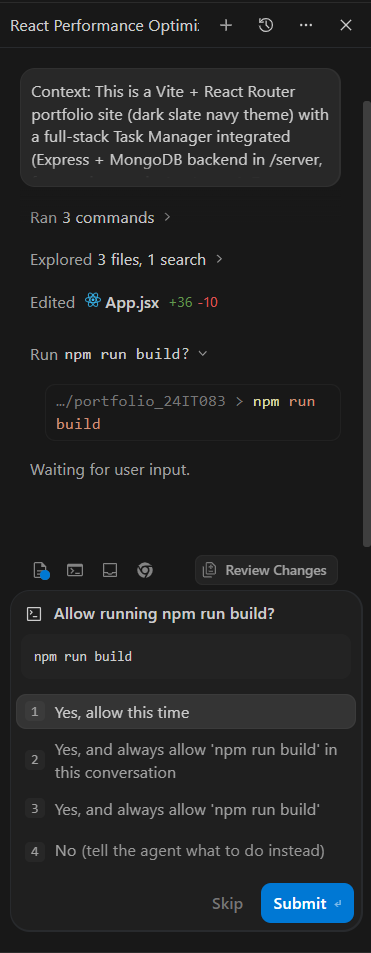
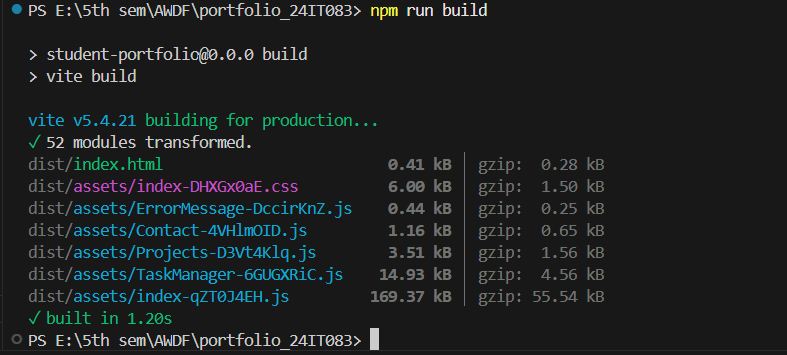
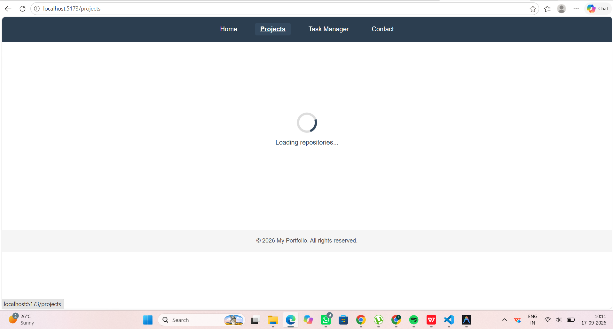
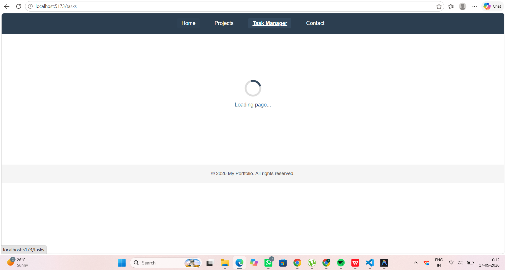

# Practical 8: Performance Optimization and Lazy Loading in React

## Overview & Objective
In this practical, route-based code splitting and lazy loading were implemented to optimize the loading performance of the React portfolio application. 

### What Was Changed and Why
- **Route-Based Code Splitting (`React.lazy`)**: The static imports for `Projects`, `Contact`, and the full-stack `TaskManager` components in `src/App.jsx` were converted into dynamic imports using `React.lazy()`.
- **Suspense Boundary with Theme Fallback**: The `<Routes>` block was wrapped in a single `<Suspense>` component configured with a custom `PageLoader` fallback that matches the site's dark slate navy theme (`--navy-dark` and `--navy`).
- **Minimum-Delay Wrapper (`lazyWithDelay`)**: A lightweight ~300ms delay wrapper was added around dynamic imports to prevent brief UI flickering / flashing of the fallback on fast network connections.
- **Selective Splitting**: Lightweight entry routes (`Home` and `NotFound`) remain statically imported for instant first-paint availability, while heavier routes (especially `TaskManager` with its full-stack CRUD and authentication UI) are deferred until requested.

---

## Before / After Bundle Size Comparison

### Build Output Table

| State | Asset File / Chunk | Raw Size | Gzip Size | Notes |
|---|---|---|---|---|
| **Before** (Single Bundle) | `dist/assets/index-BHfEfkwX.js` | **187.37 kB** | **60.30 kB** | Single monolithic JS bundle containing all pages and dependencies |
| **After** (Code-Split) | `dist/assets/index-qZT0J4EH.js` | **169.37 kB** | **55.54 kB** | **Initial bundle** (Home, NotFound, Navbar, Footer, React core) |
| **After** (Code-Split) | `dist/assets/TaskManager-6GUGXRiC.js` | **14.93 kB** | **4.56 kB** | Async chunk loaded on-demand when navigating to `/tasks` |
| **After** (Code-Split) | `dist/assets/Projects-D3Vt4Klq.js` | **3.51 kB** | **1.56 kB** | Async chunk loaded on-demand when navigating to `/projects` |
| **After** (Code-Split) | `dist/assets/Contact-4VHlmOID.js` | **1.16 kB** | **0.65 kB** | Async chunk loaded on-demand when navigating to `/contact` |

> **Initial JS Bundle Reduction:** The upfront JavaScript payload decreased from **187.37 kB → 169.37 kB** (~18.00 kB / **~9.6% smaller on first load**), improving First Contentful Paint (FCP) and Time to Interactive (TTI).

---

## Screenshots

### 1. Before Build (Monolithic Bundle)

### 2. After Build (Split Route Chunks)

### 3. Suspense Fallback UI — Projects Route (Slow 3G Network Throttling)

### 4. Suspense Fallback UI — Tasks Route (Slow 3G Network Throttling)

---

## Key Questions / Analysis

### 1. Difference between the initial bundle and a lazy-loaded chunk in terms of when each downloads
- **Initial Bundle**: Downloads synchronously during the **initial page load** when a user first visits the website. The browser must completely download, parse, and execute this bundle before the initial view becomes interactive.
- **Lazy-Loaded Chunk**: Downloads **on-demand asynchronously** over the network only when the user triggers a specific route or action (for example, clicking a navigation link to `/projects` or `/tasks`).

### 2. Why lazy loading improves perceived performance even though total downloaded code is the same
- While the total combined size across all chunks is approximately the same as the single bundle, lazy loading **drastically reduces the upfront payload (Time to Interactive / First Contentful Paint)**.
- Users only download the code required for the current view they are visiting. Heavy components (such as the full-stack Task Manager) do not delay the initial render of the homepage. By the time the user chooses to navigate to another page, the initial critical rendering path is already complete.

### 3. A situation where lazy loading wouldn't be worth the complexity
- **Small / Single-View Applications**: When the entire application bundle is already very small (< 50–100 kB total), code splitting adds unnecessary network request overhead, loading spinner states, and bundle boilerplate without any perceptible speed benefit.
- **Critical Above-the-Fold Landing Components**: Components that must render immediately on every single visit (such as the main landing hero section or global navigation bar) should not be lazy-loaded, as doing so introduces an artificial loading delay for the primary user experience.
